# Neural Baby Talk学习笔记

[[1803.09845] Neural Baby Talk](https://arxiv.org/abs/1803.09845)

## 1、介绍

- 深度学习时代

  采用LSTM模型，过分依赖language model，导致caption经常与图像内容关联不够。

- 深度学习之前

  更依赖图像内容，而对language model关注不多，例如采用一系列视觉检测器检测图像内容，然后基于模板或者其他方式生成caption

- 作者观点

  减少对语言模型的依赖，更多地结合图像内容。

  采用物体检测器检测图像中的物体(visual words)，然后在每个word的生成时刻，自主决定选取text word（数据集中的词汇） 还是 visual word（检测到的词汇）。

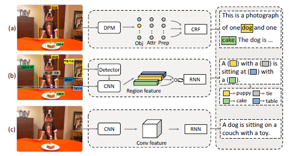

图1

如图1所示，(a)为Baby Talk模型示意图，(b)为Neural Baby Talk模型示意图，(c)为neural image captioning模型示意图。Neural Baby Talk方法先生成一个句子模板，其中关键单词空缺，如图中的有色方块所示，接着，目标检测器对图片中目标进行检测，并将检测得到的物体名称填入句子模板中。

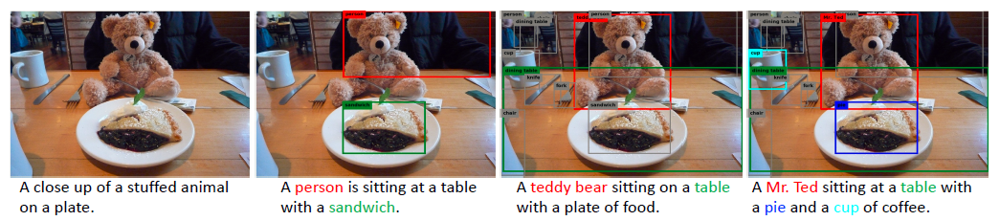

如上图，展示了使用4个不同目标检测器的效果，(1)未使用目标检测器；(2)使用弱目标检测器，只检测出来“person”和"sandwich"；(3)使用在COCO数据集上训练出来的目标检测器，结果较为准确；(4)使用具有新奇概念novel concepts的目标检测器，图片captions训练集中并没有“Mr. Ted”和"pie"词汇。

本文提出的神经方法会生成一个句子模板，模板中的空槽和图片区域捆绑在一起。在每个time step，模型决定选择从textual词汇表生成词语还是使用视觉词汇。

**visual word：**

每个visual word对应一个区域$r_I$，如图1所示，“puppy”和"cake"分别属于“dog”和"cake"的bounding box类别，是visual words。

**textual word：**

来自Caption的剩余部分，图1中，“with” 和 “sitting”与图片中的区域没有关系，因此是textual words。

## 2、方法

**目标：**

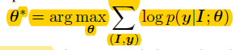

其中，$I$为输入图片，$y$为图片描述语句。

公式可以分成两个级联的目标：

1. 最大化生成句子“模板”的概率；

   如图3所示，“A \<region-2>is laying on the \<region-4> near a \<region-7>"即为“模板”。

2. 最大化依据grounding区域和目标识别信息得到的visual words的概率；

图3

### “Slotted” Caption模板生成

本文使用recurrent neural network（RNN）生成Caption的模板。此RNN由LSTM层组成，CNN输出的feature maps作为其输入。

使用pointer network，通过调制一个在grounding区域上基于内容的注意力机制来生成visual words的槽“slot”。

### Caption改良：槽填充

使用目标检测框架在grounding区域上，可以识别区域内的物体类别，例如，“狗”。

还需要对词语进行变换使其适合当前文本上下文，比如单复数、形态等。

而Captions指的是比较时尚的词“puppy”，或复数形式“dogs”。因此，为了适应语言的变化，我们模型生成的visual words是经过细致改良过的，变换的主要措施为：1、单复数，确定此类别物体是否有多个（如dog跟dogs）；2、确定细粒度的类别名称（如dog可以细分为puppy等）；

两种变换分别学习两个分类器实现，单复数用二分类器，fine-grained用多分类做。

### 整体实现

**目标函数：**

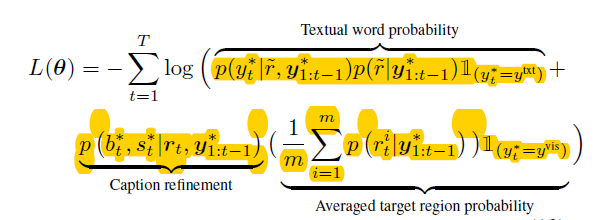

第一部分为Textual word 概率，第二部分为Caption细微改良（针对词形态），第三部分为目标区域平均概率。

其中，$y_t^*$为ground truth caption在t时刻的word；$1_{(y_t^*=y^{txt})}$为指示函数，yt*为textual word则为1，否则为0；$b_t^{\*}$为target ground truth 复数形式，$s_t^{\*}$为target ground truth分类名称进行细微调整；$({r_t^i})_{i=1}^m$为target grounding区域在t时刻对应的visual word。

### 实现细节

**Detection model：**Faster R-CNN

**Region feature：**预训练的ResNet-101

输入图片大小为576X576，我们随机裁切为512X512，然后作为CNN的输入。
$$
v_i=[v_i^p;v_i^l;v_i^g]
$$
Region feature$v_i$由3部分组成，$v_i^p$为pooling feature of RoI align layer（**不明白**），$v_i^l$为location feature，$v_i^g$为区域$i$的类标签对应的glove vector embedding。

**Language model：**基本的注意力模型使用2层的LSTM

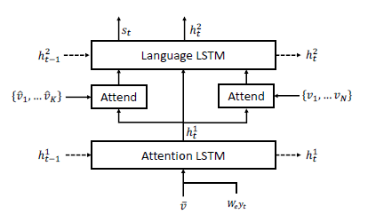

图4 Language model

如图4所示，attention layers有两层，分别用来注意Region feature()和CNN最后一个卷积层输出的feature

**训练细节：**

2层LSTM的隐层大小为1024

attention layer隐藏单元数量为512

input word embedding大小为512

优化器：Adam

学习速率：初始学习速率为$5\times10^{-4}$，每3个epoch衰减至原来的0.8倍

epoch数量：最初训练了50个epochs

在训练过程中，没有对CNN进行finetune

batch size：COCO（100） Flickr30k（）50

**Detector pre-training**

使用开源的Faster-RCNN来训练目标检测器。

对于Flickr30K：

visual words取数据集中出现超过100次的词，总共460个detection labels。

detection labels和visual words是一一对应的。

我们不再对检测得到的类别名称进行调整，只关注物体是否有多个。

对于COCO：

使用ground truth detection annotations来训练目标检测器。

**Caption pre-processing**

我们将COCO和Flickr30k数据集中caption的长度缩减，使其不超过16个词。

建立一个词汇表，将出现超过5次的词都加入表内，COCO和Flickr30k词汇表长度分别为9587和6864。

### 结果

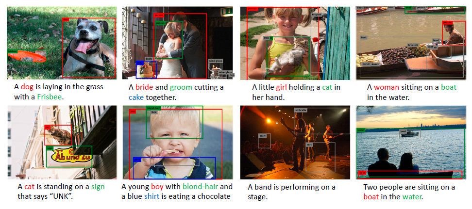

图5 标准Image Caption任务结果

如图5所示，各种颜色的框与句中的词（visual word）相对应，灰色的区域检测结果未被caption采用。

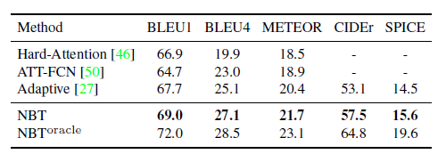

flickr30k结果

COCO结果

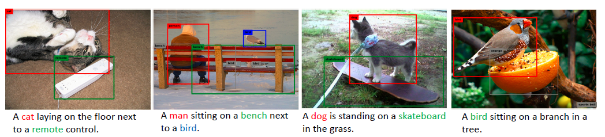

图6 robust image captioning task结果

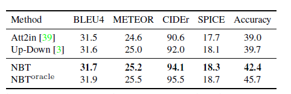

robust-COCO

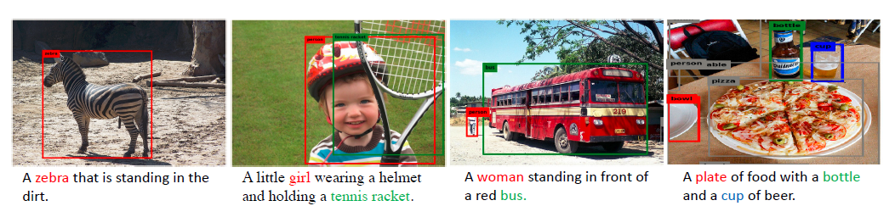

图7 novel object captioning task

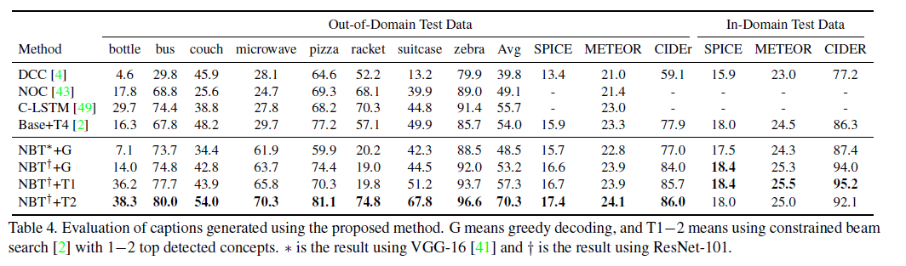

**关键点：**

- 采用bottom up attention (即region feature)，学习两组word probability， 一个是text words, 一个是visual words；
- text words概率与bottom up attention模型基本一致；
- visual words概率采用当前hidden state与region features的相关性学习region 权重（即attention），每个region对应一个word；
- 借鉴了Adaptive attention的做法，学习了一个sentiment gate(哨兵)，决定当前时刻应该采用text 还是 visual word(权重)，用其对visual words的概率进行缩放。最终选取某个单词是取所有words概率的max；
- 如果选取了visual word, 那么还需要对词语进行变换使其适合当前文本上下文，比如单复数、形态等。作者考虑两种变换：单复数（如dog跟dogs）、类别的fine-grained标签（如dog可以细分为puppy等）。两种变换分别学习两个分类器实现，单复数用二分类器，fine-grained用多分类做。

**Attention Mechanism** 注意力机制

> Attention给模型赋予了区分辨别的能力；
>
> 在图像标注应用中，可以解释图片不同的区域对于输出Text序列的影响程度；
>
> 在机器翻译、语音识别应用中，为句子中的每个词赋予不同的权重，使神经网络模型的学习变得更加灵活（soft），同时Attention本身可以做为一种对齐关系，解释翻译输入/输出句子之间的对齐关系，解释模型到底学到了什么知识，为我们打开深度学习的黑箱，提供了一个窗口；
>
> **Attention Mechanism可以帮助模型对输入的$x$每个部分赋予不同的权重，抽取出更加关键及重要的信息，使模型做出更加准确的判断，同时不会对模型的计算和存储带来更大的开销，这也是Attention Mechanism应用如此广泛的原因。**

bottom up attention

Adaptive attention

