# 第三周项目报告

## 目录
[Show Attend and tell](#Show Attend and tell)  
[NeuralBabyTalk](#NeuralBabyTalk)  
[评价度量指标](#评价度量指标)
[系统演示说明](#系统演示说明)
## Show Attend and tell
### 模型示例说明
----------
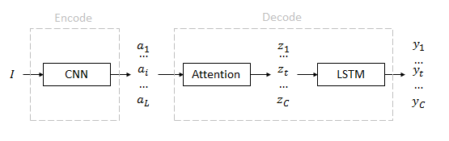  
**`I:`**图片信息矩阵[224x224x3]  
经seq2seq模型中的encoder(**CNN**)得到
[196(14x14),512],它代表图片被分割成了很多区域  
Attend决定单词注意在哪个区域,输出区域概率  
最后组合embdeding进行训练
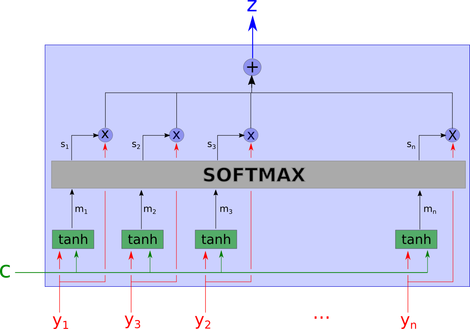  
此图表示attention的部分
**`C:`**是LSTM的memorey state  
CNN的输出和C进行全连接经softmax生成每个区域的注意力权值[1x196]  

### 遇到的问题
----------
1. 实现show attend and tell 中的源代码时，由于网上代码的导出图像元素到文件中的时候是直接建立了一个超级大(8w个224x224的img)的 ndarray 用于存储训练数据的信息。这样本地内存是不足的，无法创建。 需要使用像show and tell 模型中的 分shard方式导出。
2. 示例代码是输出的 pkl 和 hkl。不能使用之前的 tfrecord,需要把这部分代码编入我们之前的show and tell 框架中。
3. 根据 queue 读取 tfrecord 
  
在处理海量数据集的训练时,无法把数据集一次全部加载到内存里,需要一边从硬盘中读取数据,一边进行训练计算  
Tensorflow提供了对session中多线程的管理  
`tf.train.Coordinator`:用来管理在session中的多个线程  
`tf.train.start_queue_runners`:函数执行后才会把teensor推入内存序列里供计算单元调用  
4. 在图片预处理方面遇到的问题:  
`tf.image.resize_image_with_crop_or_pad` 和作者的中心截取(`224*224`)得到的图片是不一样的 会损失很多信息。如图:
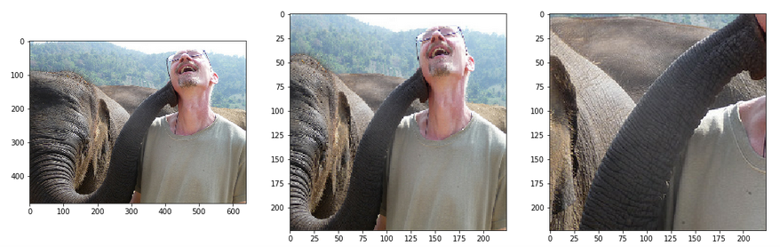  
最左边是原图,中间是自己写的一个方法得到的图,右边是tf的中心截取方法得到的图  
自己写的一个截取的方法说明:首先比较长宽，截取掉长宽差的部分，变成一个正方形，resize 到`224*224`尽可能多的保存图像信息。 但是这样会有一个问题。 因为读取出来的 tfrecord 中的图片 都是以tensor 的形式存储的。 而操作tensor 形式的相关代码也只能用tensor 。 这样在判断长宽的时候就会多出来一个tf.cond:

		result = 
		tf.cond(tf.less(height,width),
		   lambda:width_gt_height(height,width),
		   lambda:height_gtoreq_width(height,width),
		   name="cond_size_pick"))

生成上，下，左，右高度的时候 也会出现新的tensor 节点。 这样由于预处理的图像在 训练数据获取的循环中的。 所以感觉会不断地增加节点，最后内存会爆掉。  
此问题的三个解决方法 ：  

a. 直接 使用处理好后的图片做 tfrecord

b. 预处理直接 resize 不减切了

c. 利用一些方法去掉那几个节点

## NeuralBabyTalk
### 模型说明
----------
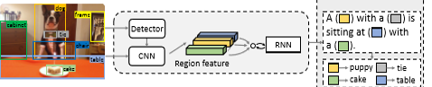  

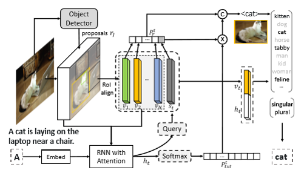

Object Detector的检测结果和feature一起进入带有Attention的RNN  
得到隐层结果经softmax得到相应Caption信息的概率  
另一部分,和图像的feature一起组成一个区域概率  
这两部分相乘的结果和region信息生成下一个词的概率比较(这里的C是compare的意思)  
比较的结果决定用什么信息生成下一个词:  
1. 生成连接词(用P_txt)
2. 需要用到region信息(生成对应的插槽)  
生成模板,选择实体对应的词后判断单复数形式填入句子
### 运行环境
----------
NeuralBabyTalk的代码需要使用docker环境
- dockerio 之前的docker版本
- dockeree 企业版
- dockerce 社区版
- Nvidia Docker docker基础上封装的版本,支持GPU
> 注:代码运行环境需要 Nvidia Docker,在此之前需要安装Docker支持,  
> 这里本地安装dockerce 社区版
### 遇到的问题
----------
复现 NeuralBabyTalk 的代码时,第一步就是需要配置docker的环境,  
在此过程中出现了很多问题,现在仍在解决中,下面是一些错误信息

	Cannot connect to the Docker daemon at unix:///var/run/docker.sock. Is the docker daemon running?

## 评价度量指标
### 客观评价指标 
----------
- BLEU 
	- **优点:**
	- 方便、
	- 快速、
	- 结果有参考价值
	- **缺点:**
	- 不考虑语言表达（语法）上的准确性； 
	- 测评精度会受常用词的干扰； 
	- 短译句的测评精度有时会较高； 
	- 没有考虑同义词或相似表达的情况，可能会导致合理翻译被否定；

- ROUGE
	- 计算N元组在参考译文和待评测译文中的共现频率 
	-     
	- Caption越多,译文的ROUGE与人工翻译越相关.
- METEOR 
- CIDEr
### 主观评价指标 
----------
- 流畅度 
- 相关性
### 评价指标说明
----------
#### N-gram
目前主要探索了客观评价指标中BLEU和ROUGE-L,  
他们都是基于n-gram的共现信息来评价参考译文的  
N-gram的匹配规则，原理比较简单，就是比较译文  
和参考译文之间n组词的相似的一个占比,eg:  
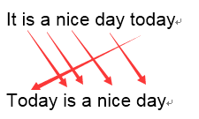  
结果为5/6

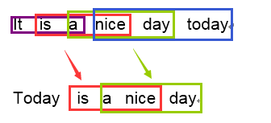  
结果为2/4
#### BLEU-X
BLEU是双语互译质量评估辅助工具,做不到100%准确,只能租到大概判断,  
目标是给出一个快且不差的自动评估解决方案  
##### 1. 防止百搭
考虑到N-gram的局限性,BLEU会对重复的词进行定量的限制,公式如下:  
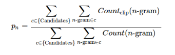  
考虑1-gram的情况,给出参考译文如下:  

	the cat is on the mat #句中有2个the
	there is a cat on the mat #句中有1个the
机器译文如下: 

	the the the the the the the #句中有7个the
此时the在所有参考译文中的出现次数的最大值为2,其结果为2/7而非100%
##### 2. 短句惩罚
在这种评分机制下,机器会倾向于翻译短的句子,从而在语义上很可能不完整(只得到半句话),所以需要增加惩罚因子:  
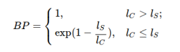
##### 3. 评分公式
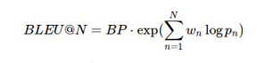

#### ROUGE-L
  
其中  
- X是所有的参考译文(即Caption),  
- Y是待评测的译文(即翻译出的句子),  
- LCS表示最长公共子序列  
- m,n分别是X和Y的词长  
- 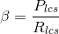 

#### 各指标的运行结果:  
----------
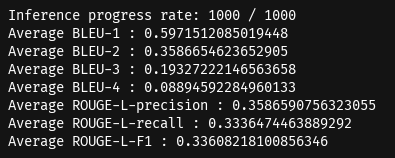  
inceptionv3_flickr8k结果  
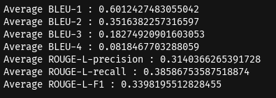  
inceptionv3_flickr8k结果  
  
inceptionv3_flickr8k结果  
  
inceptionv3_flickr8k结果   
汇总结果如下:  

| |inceptionv3_flickr8k|inceptionv4_flickr8k|inceptionv3_flickr30k|inceptionv4_flickr30k|
|:-|:-|:-|:-|:-|
|BLEU-1|0.597151209|0.584429209|0.607961059|0.601242748|
|BLEU-2|0.358665462|0.339886208|0.360472571|0.351638226|
|BLEU-3|0.193272221|0.177754792|0.190751853|0.182749209|
|BLEU-4|0.088945923|0.082492608|0.089388942|0.08184677|
|ROUGE-L-precision|0.358659076|0.360638715|0.319957472|0.314036627|
|ROUGE-L-recall|0.333647446|0.330924519|0.392941932|0.385867536|
|ROUGE-L-F1|0.336082181|0.33559661|0.345587694|0.339819551|

## 系统演示说明
优化点如下:

1. 模型可切换，只需修改 ckpt 和 vocabulary 文件的路径即可
2. 图片缓存开关，可以控制用户上传图片是否缓存
3. 性能优化，只再项目启动时加载一次模型，用户可及时等到运行结果无需等待
4. web页面展示布局优化
5. 对异常情况进行处理，保证系统不崩溃
	- 增加对用户上传文件类型的校验，校验不通过给出标红文字提示
	- 增加对png文件处理，使文件变成jpg格式的3通道文件
	- 增加对上传按钮的验空逻辑，用户未选择文件而点击上传时给出标红文字提示
	- 增加对文件内容校验，用户修改其他类型文件后缀而变成的jpg文件给出标红文字提示
