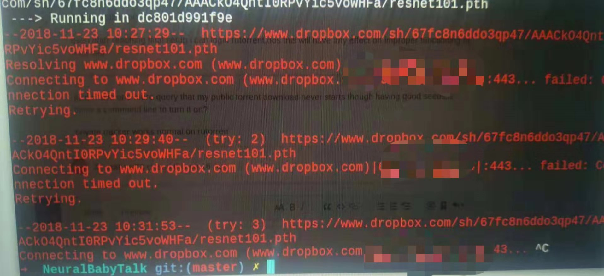
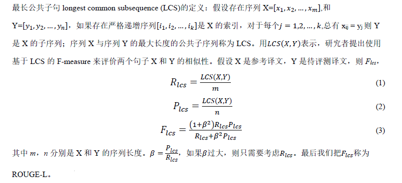
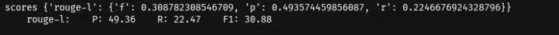

# 第三周项目报告

## 目录

[Attendtion](#Attendtion)  
[NeuralBabyTalk](#NeuralBabyTalk)  
[评价度量](#评价度量)

## Attendtion
### 遇到的问题
1. 实现show attend and tell 中的源代码时，由于网上代码的导出图像元素到文件中的时候是直接建立了一个超级大(8Wx224x224维度)的 ndarray 用于存储训练数据的信息。这样我的内存是不足的，没法创建。 需要使用像show and tell 模型中的 分shard方式导出。
2. 网上代码是输出的 pkl 和 hkl。不能使用之前的 tfrecord,需要把这部分代码编入我们之前的show and tell 框架中。

2. 根据 queue 读取 tfrecord 

3. 在图片预处理方面遇到的问题。 `tf.image.resize_image_with_crop_or_pad` 和作者中的中心截取`224*224`感觉截取出来的图片是不一样的 会损失很多信息。 自己写了一个截取的方法，首先比较长宽，截取掉长宽差的部分，变成一个正方形，resize 到`224*224`尽可能多的保存图像信息。 但是这样会有一个问题。 因为读取出来的 tfrecord 中的图片 都是以tensor 的形式存储的。 而操作tensor 形式的相关代码也只能用tensor 。 这样在判断长宽的时候就会多出来 一个tf.cond 。 生成上，下，左，右高度的时候 也会出现新的tensor 节点。 这样由于预处理的图像在 训练数据获取的循环中的。 所以感觉会不断地增加节点，最后内存会爆掉。

   想的三个解决方法 ：  

	1.  直接 使用处理好后的图片做 tfrecord
	
	2. 预处理直接 resize 不减切了
	
	3.  利用一些方法去掉那几个节点

                                            

4. 把 vgg 的模型导入了 im2txt 中 只获取第5层 conv 的图像元素
5. 正在修改相关代码中，这周没有结果

## NeuralBabyTalk

[https://github.com/jiasenlu/NeuralBabyTalk](https://github.com/jiasenlu/NeuralBabyTalk)

### Docker & nvidia-docker

- DockerCE,社区版
- DockerEE,企业版
- [Nvidia Docker](https://github.com/NVIDIA/nvidia-docker)
### ISSUE1
`Cannot connect to the Docker daemon at unix:///var/run/docker.sock. Is the docker daemon running?`

`service docker start`

或

`systemctl restart docker`
`systemctl status docker`
### ISSUE2

`docker build -t nbt .` 报错

## 评价度量

### 客观评价指标 
- BLEU 
- ROUGE
	- 计算N元组在参考译文和待评测译文中的共现频率
- METEOR 
- CIDEr
### 主观评价指标 
- 流畅度 
- 相关性
### 关于 ROUGE

#### ROUGE-L
---

#### 运行结果截图

